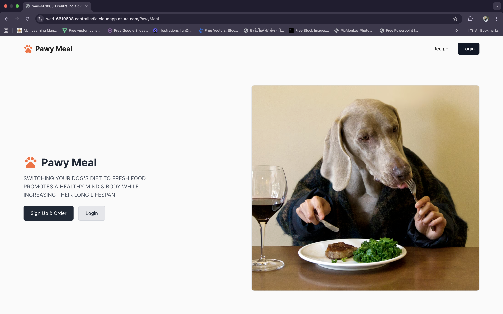
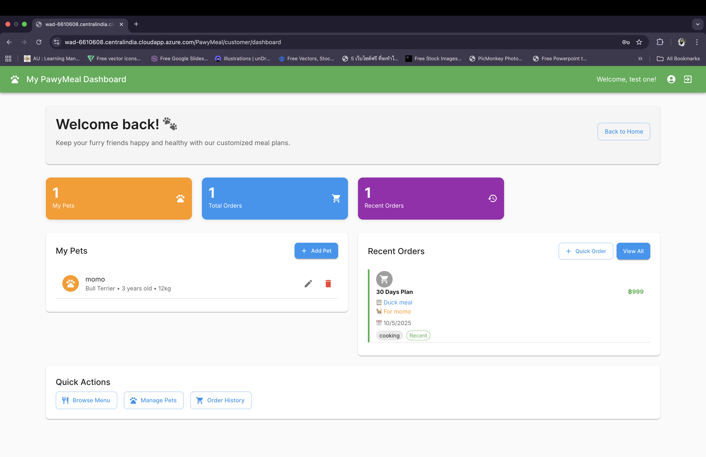
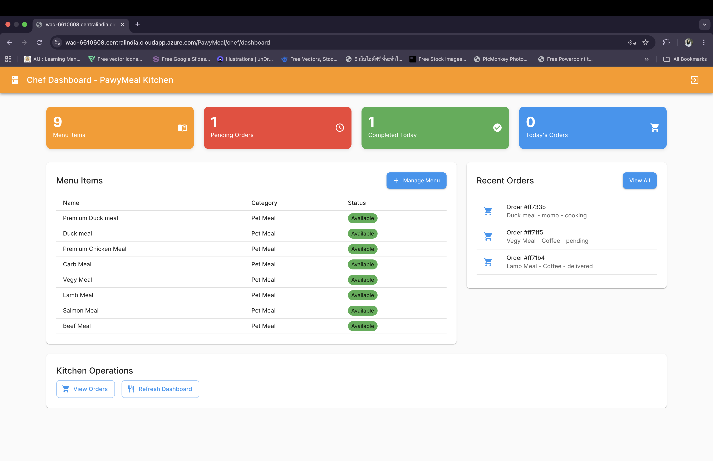
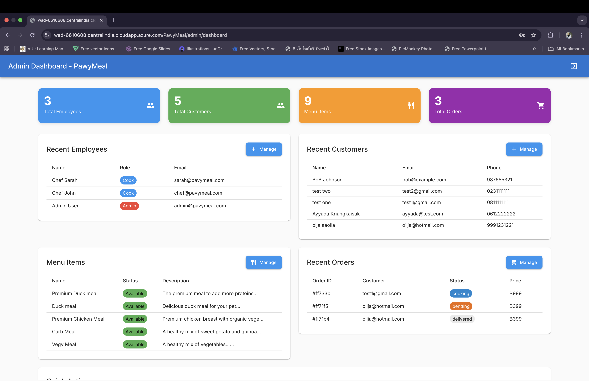
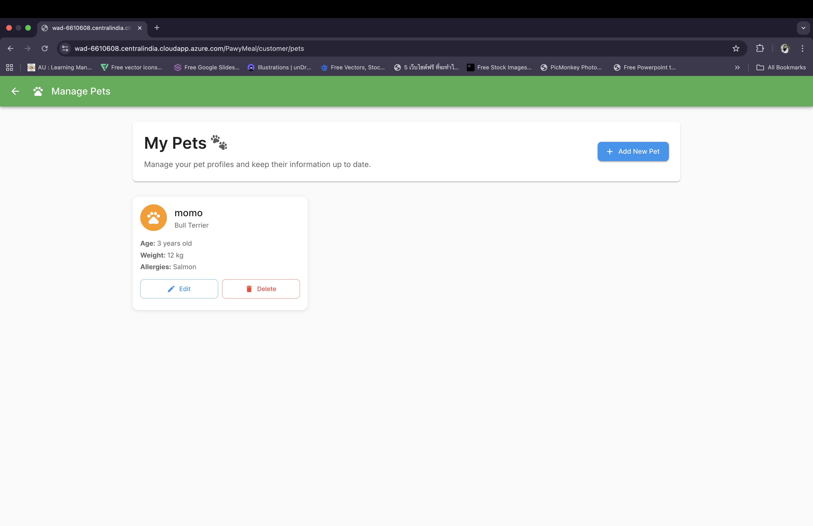
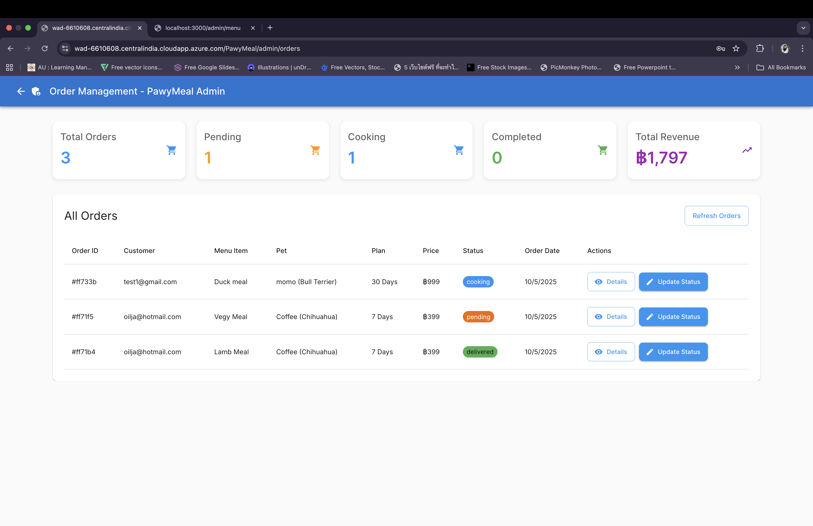

# 🐾 Pawy Meals - Pet Nutrition Management System

A comprehensive full-stack web application for managing pet nutrition with custom meal plans, order tracking, and multi-role user management.

## 👥 Team Members

- **Ayyada K** - Full Stack Developer & Database Designer
- **[Team Member 2]** - [Role]
- **[Team Member 3]** - [Role]

## 📋 Project Description

Pawy Meals is a pet nutrition management platform that connects pet owners with professional chefs to provide customized meal plans for pets. The system supports multiple user roles including customers, chefs, administrators, and delivery drivers.

### 🎯 Key Features

- **Multi-Role Authentication**: Customer, Chef, Admin, and Delivery Driver roles
- **Pet Profile Management**: Detailed pet profiles with dietary requirements and health information
- **Custom Meal Planning**: Nutritionally balanced meals tailored to individual pets
- **Order Management**: Complete order lifecycle from creation to delivery
- **Admin Dashboard**: Comprehensive management tools for administrators
- **Chef Interface**: Tools for meal preparation and order management
- **Delivery Tracking**: Real-time order status updates

### 🏗️ Data Model (3 Main Entities)

#### 1. **Pet** 🐕
- Pet profiles with breed, age, weight, size
- Activity levels and dietary requirements
- Allergies and medical conditions
- Preferred proteins and restrictions

#### 2. **Meal** 🍽️
- Detailed meal information with ingredients
- Nutritional breakdown (calories, protein, fats, etc.)
- Cooking instructions and preparation time
- Suitability for different pet types
- Pricing and availability

#### 3. **Order** 📦
- Customer and pet information
- Selected meals and quantities
- Delivery address and scheduling
- Payment and order status tracking
- Chef assignment and delivery tracking

### 🛠️ Technology Stack

- **Frontend**: Next.js 15, React 19, Material-UI (MUI)
- **Backend**: Next.js API Routes, RESTful API
- **Database**: MongoDB with Mongoose ODM
- **Package Manager**: pnpm
- **Authentication**: Custom JWT-based auth
- **Styling**: Material-UI Components + Custom CSS

## 🚀 Getting Started

### Prerequisites

- Node.js 18.0 or higher
- MongoDB 4.4 or higher
- pnpm package manager

### Installation

1. **Clone the repository**
   ```bash
   git clone <repository-url>
   cd pawy-meal
   ```

2. **Install dependencies**
   ```bash
   pnpm install
   ```

3. **Set up environment variables**
   ```bash
   cp .env.local.example .env.local
   ```
   Update the `.env.local` file with your configuration:
   ```env
   MONGODB_URI=mongodb://localhost:27017/pawy_meals
   NODE_ENV=development
   NEXTAUTH_SECRET=your-secret-key-here
   NEXTAUTH_URL=http://localhost:3000
   ```

4. **Start MongoDB**
   ```bash
   # Using MongoDB Community Edition
   mongod

   # Or using Docker
   docker run -d -p 27017:27017 --name mongodb mongo:latest
   ```

5. **Run the development server**
   ```bash
   pnpm dev
   ```

6. **Open your browser**
   Navigate to [http://localhost:3000](http://localhost:3000)

## 📖 API Documentation

### 🐾 Pet Management API

#### GET /api/pet
- **Description**: Retrieve pets with filtering and pagination
- **Query Parameters**:
  - `ownerId`: Filter by owner ID
  - `breed`: Filter by breed
  - `size`: Filter by size (Small, Medium, Large, Extra Large)
  - `activityLevel`: Filter by activity level
  - `page`: Page number (default: 1)
  - `limit`: Items per page (default: 10)

#### POST /api/pet
- **Description**: Create a new pet profile
- **Required Fields**: name, breed, age, weight, size, activityLevel, ownerId

#### PUT /api/pet/[id]
- **Description**: Update a specific pet profile

#### DELETE /api/pet/[id]
- **Description**: Soft delete a pet profile

### 🍽️ Meal Management API

#### GET /api/menu
- **Description**: Retrieve meals with filtering
- **Query Parameters**:
  - `primaryProtein`: Filter by protein type
  - `category`: Filter by meal category
  - `minPrice`/`maxPrice`: Price range filtering
  - `difficulty`: Filter by cooking difficulty
  - `minRating`: Filter by minimum rating

#### POST /api/menu
- **Description**: Create a new meal
- **Required Fields**: name, description, primaryProtein, ingredients, nutrition, price, servingSize, preparationTime, category

### 📦 Order Management API

#### GET /api/order
- **Description**: Retrieve orders with filtering
- **Query Parameters**:
  - `customerId`: Filter by customer
  - `status`: Filter by order status
  - `assignedChef`: Filter by assigned chef

#### POST /api/order
- **Description**: Create a new order
- **Required Fields**: customerId, customerName, customerEmail, items, paymentMethod, deliveryAddress

### 👥 User Management API

#### GET /api/user
- **Description**: Retrieve users (Admin only)
- **Query Parameters**:
  - `role`: Filter by user role
  - `isActive`: Filter by active status

#### POST /api/user
- **Description**: Register a new user
- **Required Fields**: username, email, password, firstName, lastName, phone

## 🖼️ Screenshots

### 🏠 Home Page

*Main landing page with role-based navigation*

### 🔐 Login System

*Multi-role login with role selection*

### 📱 Customer Dashboard

*Customer view with pet management and order history*

### 👨‍🍳 Chef Dashboard

*Chef interface for meal preparation and order management*

### 👨‍💼 Admin Dashboard

*Administrative interface for system management*

### 🐕 Pet Profile Management

*Detailed pet profile creation and management*

### 🍽️ Meal Catalog

*Browse and filter available meals*

### 🛒 Order Management

*Complete order lifecycle management*

## 🗄️ Database Schema

### Collections Overview

```javascript
// Pet Collection
{
  name: String,
  breed: String,
  age: Number,
  weight: Number,
  size: Enum['Small', 'Medium', 'Large', 'Extra Large'],
  activityLevel: Enum['Low', 'Moderate', 'High', 'Very High'],
  allergies: [String],
  medicalConditions: [String],
  ownerId: String,
  isActive: Boolean
}

// Meal Collection
{
  name: String,
  description: String,
  primaryProtein: Enum['Chicken', 'Beef', 'Fish', ...],
  ingredients: [IngredientSchema],
  nutrition: NutritionSchema,
  price: Number,
  preparationTime: Number,
  category: Enum['Breakfast', 'Lunch', 'Dinner', 'Snack', 'Treat'],
  isAvailable: Boolean
}

// Order Collection
{
  orderNumber: String,
  customerId: String,
  items: [OrderItemSchema],
  totalAmount: Number,
  status: Enum['Pending', 'Confirmed', 'Preparing', 'Ready', 'Out for Delivery', 'Delivered', 'Cancelled'],
  deliveryAddress: AddressSchema,
  scheduledDeliveryDate: Date
}
```

## 🔐 User Roles & Permissions

### 👤 Customer
- Create and manage pet profiles
- Browse meal catalog
- Place and track orders
- Review meals and service

### 👨‍🍳 Chef
- View assigned orders
- Update order preparation status
- Manage meal recipes
- Track preparation times

### 👨‍💼 Admin
- Full system access
- User management
- Order management
- System analytics and reports

### 🚚 Delivery Driver
- View assigned deliveries
- Update delivery status
- Access delivery routes
- Customer communication

## 🧪 Testing

```bash
# Run unit tests
pnpm test

# Run integration tests
pnpm test:integration

# Run end-to-end tests
pnpm test:e2e
```

## 📦 Deployment

### Using Vercel (Recommended)

1. **Deploy to Vercel**
   ```bash
   pnpm build
   vercel --prod
   ```

2. **Set environment variables in Vercel dashboard**
   - `MONGODB_URI`
   - `NEXTAUTH_SECRET`
   - `NEXTAUTH_URL`

### Using Docker

```bash
# Build the Docker image
docker build -t pawy-meals .

# Run the container
docker run -p 3000:3000 --env-file .env.local pawy-meals
```

## 🤝 Contributing

1. Fork the repository
2. Create a feature branch (`git checkout -b feature/AmazingFeature`)
3. Commit your changes (`git commit -m 'Add some AmazingFeature'`)
4. Push to the branch (`git push origin feature/AmazingFeature`)
5. Open a Pull Request

## 📄 License

This project is licensed under the MIT License - see the [LICENSE.md](LICENSE.md) file for details.

## 🙏 Acknowledgments

- Material-UI for the component library
- MongoDB for the database solution
- Next.js team for the framework
- All pet nutrition experts who provided guidance

## 📞 Support

For support, email support@pawymeals.com or join our Discord channel.

---

**Made with ❤️ for pets and their humans**
